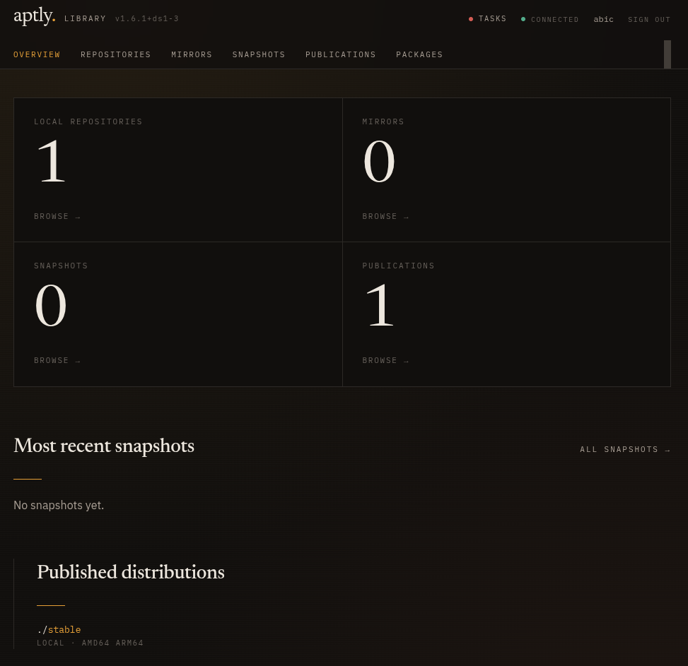
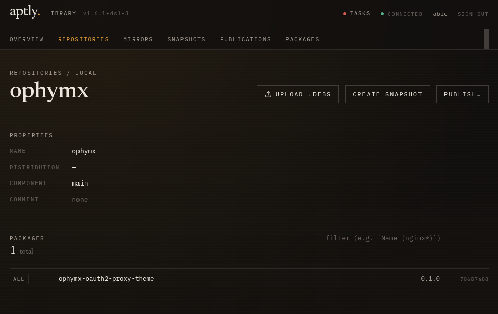
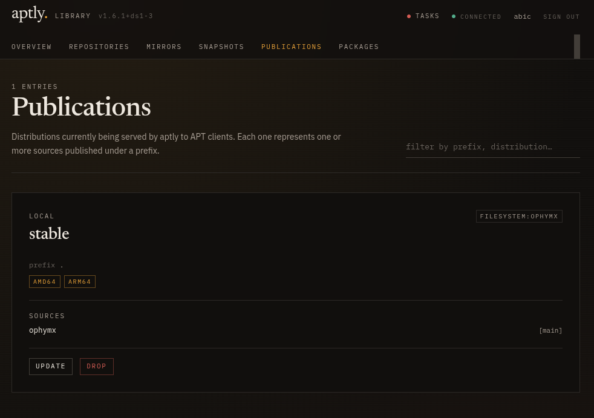

# aptly-webui

A web UI for an [aptly](https://www.aptly.info/) instance: browse
repositories, mirrors, snapshots, publications, and packages, plus a
guarded set of mutations (upload+add, create/delete snapshots, update
mirrors, publish/update/drop, …) gated on a proxy-provided role. Readers
get the catalog; writers get the action buttons.

It is a static SPA. It makes requests to `/api` on the same origin and expects
that path to be reverse-proxied to the aptly daemon. Aptly's HTTP API has no
authentication or CORS, so this UI is intended to live behind a proxy that
handles both.

> **Unaffiliated.** This project is a third-party client for aptly's REST
> API. It is not developed by, endorsed by, or otherwise associated with
> the [aptly](https://www.aptly.info/) project or its maintainers. "aptly"
> is the name of that upstream project; it is used here only to identify
> the API this UI targets.

<p align="center">
  
</p>
<p align="center">
  
  
</p>

## Stack

- Vite + React 18 + TypeScript
- Tailwind CSS (warm-dark theme, Newsreader + IBM Plex Mono/Sans)
- TanStack Query for data fetching/caching
- React Router for client-side routing
- No backend of its own — pure SPA

## Develop

```sh
npm install
cp .env.example .env.local
npm run dev
```

You need an aptly API to talk to. Two easy paths:

**No aptly handy?** Run one locally — aptly ships an HTTP API mode:

```sh
aptly api serve -listen=:8080
# .env.local:
#   APTLY_API=http://localhost:8080
# (no APTLY_TOKEN needed — local aptly has no auth)
```

**Already have a remote aptly?** Point at it and (if it's behind a bearer
token) drop the token into `.env.local`:

```
APTLY_API=https://aptly.example.internal
APTLY_TOKEN=...                # optional
APTLY_INSECURE=1               # optional — skip TLS verify (private CA)
```

The Vite dev server proxies `/api/*` to `APTLY_API`. If `APTLY_TOKEN` is
set, the proxy injects `Authorization: Bearer ${APTLY_TOKEN}` on every
forwarded request — the token stays on the dev machine and never reaches
the browser. `.env.local` is gitignored.

## Build

```sh
npm run build      # → dist/
npm run preview    # serve dist/ locally
npm run typecheck  # tsc, no emit
```

`dist/` is a fully static bundle (HTML + JS + CSS). Drop it behind any
HTTP server.

## Package as .deb

```sh
make deb   # -> dist-pkg/aptly-webui_<version>_all.deb
```

Requires [`nfpm`](https://nfpm.goreleaser.com/). The package installs the
SPA to `/usr/share/aptly-webui/` and ships two example nginx sites:

- `/usr/share/doc/aptly-webui/examples/nginx.conf` — root mount (vhost dedicated to aptly-webui)
- `/usr/share/doc/aptly-webui/examples/nginx-subpath.conf` — subpath mount (e.g. `https://host/aptly/`)

It does **not** drop anything into `/etc/nginx/`, so installing or
upgrading never touches a live config — wire it up yourself (or template
it from Ansible).

## Deploy behind nginx

The UI assumes:

1. Static files are served at `/`.
2. `/api/*` is reverse-proxied to the aptly daemon.
3. `/api/whoami` returns `{"user":"…","role":"reader"|"writer"}`. The UI
   hides write controls when `role !== "writer"`. **The UI's check is UX,
   not security** — nginx is the actual security boundary and must also
   reject writes from non-writers (see the `$aptly_blocked` gate below).
   If the `role` field is absent entirely the UI defaults to writer
   (backwards-compatible with deployments that haven't wired role
   mapping yet).

Example with [oauth2-proxy](https://oauth2-proxy.github.io/oauth2-proxy/)
in front and a single role mapping from IdP groups to `reader` / `writer`:

```nginx
# Map IdP groups (a comma-separated list in X-Auth-Request-Groups) to a
# stable role string. Adjust the group name(s) to match your IdP.
map $authed_groups $aptly_role {
  "~\baptly-writers\b"   "writer";
  default                "reader";
}

# Composite gate on role + method. Empty = allowed, "1" = blocked.
# Writers can do anything; readers can only GET/HEAD. Aptly uses
# POST/PUT/DELETE for every mutation, so this covers the full write
# surface.
map "$aptly_role:$request_method" $aptly_blocked {
  "~^writer:"             "";
  "~^reader:(GET|HEAD)$"  "";
  default                 "1";
}

server {
  listen 443 ssl http2;
  server_name aptly.example.internal;

  # SSL config omitted (use the LE fullchain, not just the leaf — Node
  # clients won't follow AIA to fetch the intermediate).

  # Require auth (oauth2-proxy upstream) for everything
  auth_request /oauth2/auth;
  error_page 401 = /oauth2/sign_in;

  # oauth2-proxy must be configured with --set-xauthrequest so it exposes
  # X-Auth-Request-{User,Email,Groups} on its /oauth2/auth response.
  auth_request_set $authed_user   $upstream_http_x_auth_request_user;
  auth_request_set $authed_email  $upstream_http_x_auth_request_email;
  auth_request_set $authed_groups $upstream_http_x_auth_request_groups;

  # SPA
  root /usr/share/aptly-webui;
  index index.html;
  location / {
    try_files $uri /index.html;
  }

  # Whoami helper used by the UI top-bar and write-control gating.
  # `signout_url` is optional and auth-provider-specific — the UI just
  # renders it as a Sign out link. Omit to hide the button.
  #
  # The two-location split is intentional: nginx's `return` runs in the
  # rewrite phase, before `auth_request` fires in the access phase, so
  # inlining the JSON in /api/whoami would substitute empty
  # $authed_user / $aptly_role. try_files forces the request into the
  # content phase; by the time @whoami's `return` evaluates, the
  # auth_request_set variables are populated. `auth_request off` in the
  # named location avoids re-firing the auth subrequest.
  location = /api/whoami {
    try_files _ @whoami;
  }
  location @whoami {
    auth_request off;
    default_type application/json;
    return 200 '{"user":"$authed_user","role":"$aptly_role","signout_url":"/oauth2/sign_out?rd=/"}';
  }

  # Proxy to aptly daemon. The actual security boundary lives here:
  # the $aptly_blocked map rejects non-writers on any mutation. The
  # bearer token (if upstream needs one) is injected from nginx; it
  # never reaches the browser.
  #
  # Same two-location dance as /api/whoami: `if ($aptly_blocked)`
  # runs in nginx's rewrite phase, before auth_request fires, so
  # checking it directly here would always see "1" (empty
  # $aptly_role). try_files defers the check into @api's content
  # phase, by which time auth_request_set has populated everything.
  location /api/ {
    try_files _ @api;
  }
  location @api {
    auth_request off;

    if ($aptly_blocked) {
      return 403;
    }

    proxy_pass http://127.0.0.1:8080;
    proxy_set_header Host $host;
    proxy_set_header X-Real-IP $remote_addr;
    proxy_set_header X-Forwarded-User $authed_user;
    # proxy_set_header Authorization "Bearer xxxxxxxxxxxxxxxx";
    # Large uploads (.deb packages):
    client_max_body_size 256m;
    proxy_request_buffering off;
  }

  # oauth2-proxy callback
  location /oauth2/ {
    proxy_pass http://127.0.0.1:4180;
    proxy_set_header Host $host;
    proxy_set_header X-Real-IP $remote_addr;
    proxy_set_header X-Forwarded-Proto https;
  }
}
```

**Notes**

- Both `map` blocks live at `http {}` level (not inside `server {}`). Put
  them in the same file alongside `server`, or in a separate `conf.d`
  file that's included before this one.
- Aptly's REST API uses GET for reads and POST/PUT/DELETE for all
  writes, so the method-based check in `$aptly_blocked` covers the full
  mutation surface.
- If your IdP delivers groups via a different oauth2-proxy header (e.g.
  `X-Forwarded-Groups`), swap the `auth_request_set` line accordingly.
- `signout_url` is an opaque string the SPA renders as a top-bar Sign
  out link — the UI doesn't know or care about your auth provider.
  Common values: `/oauth2/sign_out?rd=/` (oauth2-proxy), `/api/logout`
  (Authelia), `/_pomerium/sign_out` (Pomerium). Omit the field
  entirely to hide the button.
- If you don't run an auth proxy at all, omit the `auth_request` lines,
  the `/api/whoami` block, and both `map`s — point `/api/` straight at
  `proxy_pass`. The UI defaults to writer in that case.

### Subpath mount

The SPA discovers its own mount point at runtime by reading the URL of
its own JS bundle (`import.meta.url`) and stripping the `/assets/...`
suffix. To host it under a subpath like `https://host/aptly/`, the only
nginx changes are an `alias`, a `try_files` fallback, and a path
rewrite for `/api/`:

```nginx
location /aptly/ {
  alias /usr/share/aptly-webui/;
  index index.html;
  try_files $uri /aptly/index.html;
}

location /aptly/api/ {
  try_files _ @api;
}
location @api {
  auth_request off;
  if ($aptly_blocked) { return 403; }
  rewrite ^/aptly/api/(.*) /api/$1 break;
  proxy_pass http://127.0.0.1:8080;
  # …auth headers, client_max_body_size, etc.
}
```

No HTML rewriting, no `sub_filter`, no extra nginx modules. The router
basename and API base URL are both derived from the bundle URL — they
follow the mount automatically. A full worked example with oauth2-proxy
+ role gating is in
[`packaging/nginx/aptly-webui-subpath.conf.example`](packaging/nginx/aptly-webui-subpath.conf.example)
(installed at `/usr/share/doc/aptly-webui/examples/nginx-subpath.conf`).

## What's covered

| Section       | Routes                                  | Notes                                                                   |
| ------------- | --------------------------------------- | ----------------------------------------------------------------------- |
| Overview      | `/`                                     | Counts, recent snapshots, published distributions, daemon version.      |
| Repositories  | `/repos`, `/repos/:name`                | Local repos + their packages.                                           |
| Mirrors       | `/mirrors`, `/mirrors/:name`            | Upstream mirrors, their metadata, packages.                             |
| Snapshots     | `/snapshots`, `/snapshots/:name`        | Point-in-time copies, sortable, filterable.                             |
| Publications  | `/publish`                              | Currently-published distributions.                                      |
| Packages      | `/packages`, `/packages/:key`           | aptly-syntax search; full control fields, hashes, relations on detail.  |

Write actions (upload+add, create/delete snapshots, update mirrors,
publish/update/drop, …) appear when the proxy reports `role: "writer"`
via `/api/whoami`. The UI's check is UX only — see the nginx example
above for the `$aptly_blocked` gate that enforces the boundary
server-side.

## Aesthetic notes

- Warm-ink dark palette (no purple gradients) with a single amber accent.
- Serif display (Newsreader) for titles, IBM Plex Mono for any identifier,
  IBM Plex Sans for body.
- Treats the package archive as a **library catalog**: kicker labels, thin
  amber rules, italic counts. Dense tables, generous whitespace around them.

## Project layout

```
src/
  lib/         api client, query hooks, mutations, formatters
  components/
    ui/        primitives (button, input, badge, table, ...)
    data/      kicker headers, status dot, key-value list
    layout/    Shell + TopNav
    actions/   write-action dialogs (publish, snapshot, upload, ...)
    tasks/     task drawer + watcher
  pages/       one file per route
  index.css    design tokens + base layer
```

## License

MIT — see [LICENSE](LICENSE).
